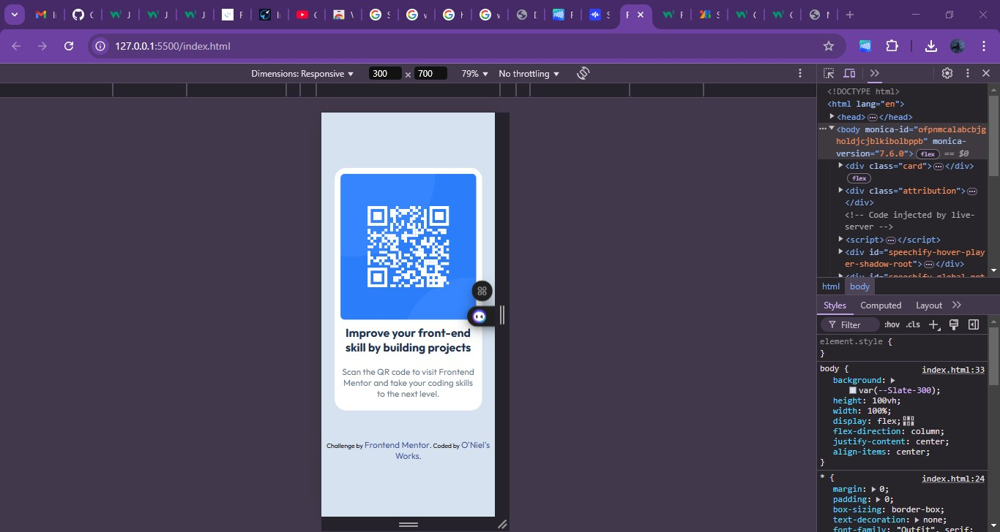
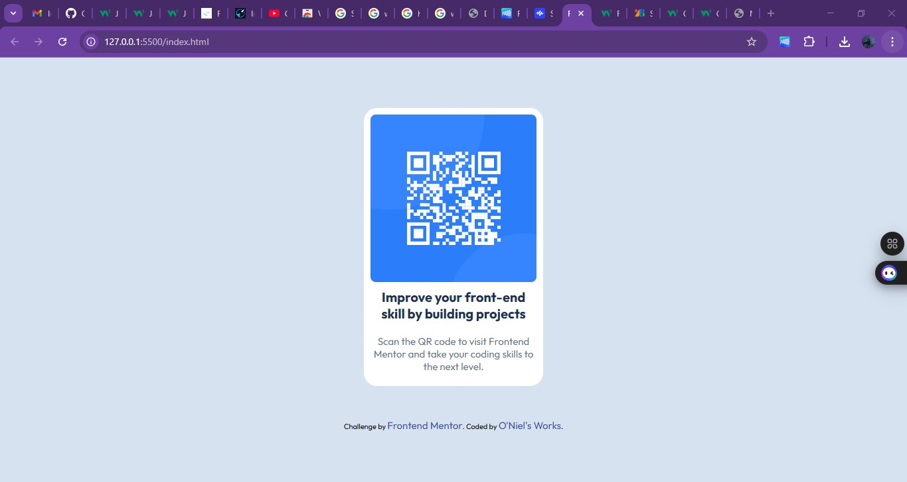

# Frontend Mentor - QR code component solution

This is a solution to the [QR code component challenge on Frontend Mentor](https://www.frontendmentor.io/challenges/qr-code-component-iux_sIO_H). Frontend Mentor challenges help you improve your coding skills by building realistic projects. 

## Table of contents

- [Overview](#overview)
  - [Screenshot](#screenshot)
  - [Links](#links)
- [My process](#my-process)
  - [Built with](#built-with)
  - [What I learned](#what-i-learned)
  - [Continued development](#continued-development)
  - [Useful resources](#useful-resources)
- [Author](#author)
- [Acknowledgments](#acknowledgments)

**Note: Delete this note and update the table of contents based on what sections you keep.**

## Overview

I would say that this was relatively easy only thing I could say that was not difficulty actually was the part 
where I had to input the font sizes and related stuff -_-

### Screenshot
Below is the screenshot of my final works on this project.

### Links

- Solution URL: [Add solution URL here](https://your-solution-url.com)
- Live Site URL: [Add live site URL here](https://your-live-site-url.com)

## My process
I took it in one go this was a great project, it made me think, as it has been quite a while since I last did some coding. I believe this journey would bring great things.

### Built with

- Semantic HTML5 markup
- CSS custom properties
- Flexbox
- CSS Grid
- PC-first workflow

## Author
- GitHub - [@O'Niel's_Works](https://github.com/Othniel-Nduka)
- Frontend Mentor - [@Othniel-Nduka](https://www.frontendmentor.io/profile/Othniel-Nduka)

